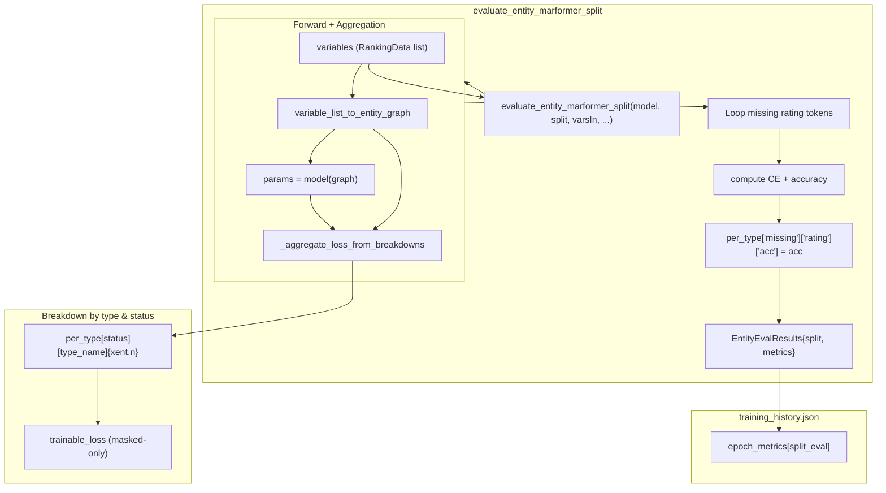

## Entity Marformer Evaluation System



### Core pieces

- **Per-type loss adapter (`LossBreakdown` in `types.py`)**:
  - For each variable type (e.g. `"rating"`, `"ranking_pairwise"`), `compute_loss_breakdown` returns:
    - `trainable_loss` (tensor): masked-only loss for this type, used in training.
    - `loss_observed`, `loss_masked`, `loss_missing` (floats): status-wise means.
    - `n_observed`, `n_masked`, `n_missing` (ints): counts for aggregation.
- **Global aggregation (`_aggregate_loss_from_breakdowns` in `eval.py`)**:
  - Loops over all types, builds a `type_mask` for each, and calls `compute_loss_breakdown`.
  - Aggregates:
    - A global **masked-only** loss:
      - This is the scalar `trainable_loss` used during training.
    - A nested per-type structure:

      ```python
      per_type[status][type_name] = {
          "xent": <per-token cross-entropy for this (status,type)>,
          "n":    <number of tokens in this bucket>,
      }
      ```

  - Returns a dict that includes `per_type` plus global counts and losses; only
    `per_type` is exposed to callers interested in metrics.
- **Training objective (`compute_trainable_loss`)**:
  - Simple wrapper around `_aggregate_loss_from_breakdowns` that returns only
    the global masked loss (`trainable_loss`).
  - Used in `training_step` to define the backprop objective (plus deviation
    regularization); **no accuracy or other metrics participate** in the loss.

### Split-level evaluation

- **Entry point**: `evaluate_entity_marformer_split(model, split, variables, types, global_param_dim, device)`.
- Steps:
  1. **Graph construction**:
     - Input `variables` is a flat `List[RankingData]` for a particular split:
       - Non-transductive:
         - `"train"`: `train_all = train_observed + train_missing`
         - `"test"`:  `test_all = test_observed + test_missing`
       - Transductive:
         - `"combined"`: `combined = train_all + test_all`
         - `"test"`:     `test_all` as above.
     - Build `graph = variable_list_to_entity_graph(variables, types)`.
  2. **Forward pass**:
     - Run `params = model(graph, device=device)` to get `[1, L, global_param_dim]`.
  3. **Loss aggregation**:
     - Call `_aggregate_loss_from_breakdowns(params, graph, types, global_param_dim, device)`:
       - This walks over all types and all tokens, using their `status` field to
         accumulate per-status, per-type CE and counts into `per_type`.
  4. **Rating missing accuracy**:
     - Independently iterate over variable tokens in the same order as the input:
       - Select those with `tok.type_name == "rating"` and `tok.status == 0`.
       - Slice logits from `params[0, idx, 1 : 1 + num_classes]`.
       - Compute CE and accuracy against `rating_value`.
     - Attach the accuracy to the nested metrics tree:

       ```python
       per_type["missing"].setdefault("rating", {})["acc"] = acc
       ```

       The `"xent"` and `"n"` for this bucket were already populated by the loss
       breakdown; we do not overwrite them here.
  5. **Return value**:
     - `EntityEvalResults(split=split, metrics=per_type)`, where:

       ```python
       metrics = {
         "observed": {
           "rating": {"xent": ..., "n": ...},
           "ranking_pairwise": {"xent": ..., "n": ...},
         },
         "masked": {
           "rating": {"xent": ..., "n": ...},
           "ranking_pairwise": {"xent": ..., "n": ...},
         },
         "missing": {
           "rating": {"xent": ..., "n": ..., "acc": ...},  # acc only for ratings
           "ranking_pairwise": {"xent": ..., "n": ...},
         },
       }
       ```

### Integration with training history

- In `on_train_epoch_end`, we build an `epoch_metrics` entry with:

  ```python
  epoch_metrics = {
      "epoch": current_epoch,
      "total_loss": total_train_loss,
      # Non-transductive:
      "train_eval": {
          "split": "train",
          "metrics": train_eval.metrics,
      },
      # Always present:
      "test_eval": {
          "split": "test",
          "metrics": test_eval.metrics,
      },
      # Transductive only:
      "combined_eval": {
          "split": "combined",
          "metrics": combined_eval.metrics,
      },
  }
  ```

- This list of `epoch_metrics` dicts is written out as `training_history.json`
  in the run directory at the end of training.
- Any downstream tool (Python, notebook, plotting script, or another agent)
  can:
  - Load `training_history.json`,
  - For each epoch and split:
    - Access status-wise, type-wise curves like:
      - `"metrics"["missing"]["rating"]["xent"]` (rating CE on missing),
      - `"metrics"["missing"]["rating"]["acc"]`  (rating accuracy on missing),
      - `"metrics"["masked"]["ranking_pairwise"]["xent"]`, etc.

### Design rationale

- **Single source of truth for losses**:
  - `LossBreakdown` per type and `_aggregate_loss_from_breakdowns` are the only
    components that know how to interpret the parameter stream and statuses.
  - Training and evaluation both rely on this shared logic; only the way we
    *summarize* metrics differs.
- **Minimal evaluation API**:
  - `EntityEvalResults` intentionally keeps just `split` and `metrics`.
  - All higher-level views (global masked loss, missing-only accuracy, etc.)
    can be reconstructed from the nested `metrics` dict.
- **Status-driven semantics**:
  - Both loss and metrics use the `status` field on tokens:
    - `0` = permanently missing (never supervised),
    - `1` = masked for training (supervised and used in objective),
    - `2` = observed (only for metrics).
  - This keeps the evaluation layer robust to how variables are grouped into
    splits (train/test/combined); the semantics are always driven by status.
