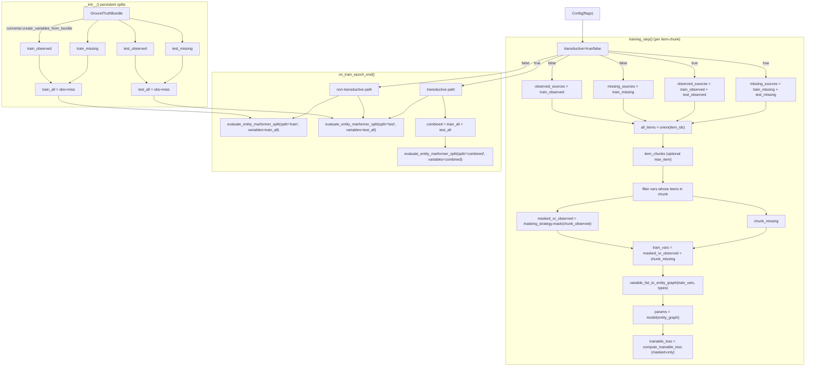

## Entity Marformer Transductive Behavior

### Splits and persistent state

- In `EntityMarformerLightningModule.__init__`, we construct four splits directly from the bundle via the shared `DataConverter`:
  - `self.train_observed`, `self.train_missing`
  - `self.test_observed`, `self.test_missing`
- For evaluation we also define:
  - `self.train_all = train_observed + train_missing`
  - `self.test_all  = test_observed + test_missing`
- These four lists are **never mutated** by training; they act as a canonical view of the bundle partition.

### Training-time behavior

- The `transductive` flag only affects **which variables are visible to the training step**, not how losses are computed:
  - Start each step with:
    - `observed_sources = self.train_observed`
    - `missing_sources  = self.train_missing`
  - If `transductive` is enabled:
    - `observed_sources += self.test_observed`
    - `missing_sources  += self.test_missing`
- For each item-chunk:
  - Filter `observed_sources` / `missing_sources` by the items in the chunk.
  - If `max_item` is set, `training_step` splits items into multiple chunks and combines
    chunk losses as a weighted average by the number of masked tokens (fallback weight = 1).
  - Apply `masking_strategy.mask(chunk_observed)` to get `masked_or_observed`.
  - Build `train_vars = masked_or_observed + chunk_missing`.
  - Convert to an `EntityGraph` using `variable_list_to_entity_graph(train_vars, types)`.
  - Run the model once: `params = model(graph, device=device)`.
  - Compute the scalar **trainable loss** via `compute_trainable_loss`, which:
    - Aggregates per-type `LossBreakdown` objects,
    - Uses only the **masked** subset to define the objective.
  - Add deviation regularization and backprop on this scalar.

### Epoch-end evaluation (non-transductive)

- When `transductive=False`, `on_train_epoch_end` evaluates splits separately:
  - Train split:
    - `train_eval = evaluate_entity_marformer_split(model, "train", self.train_all, ...)`
  - Test split:
    - `test_eval  = evaluate_entity_marformer_split(model, "test",  self.test_all,  ...)`
- Both calls:
  - Build a full graph from **observed + missing** variables,
  - Let the `status` field (0/1/2) drive missing/masked/observed decomposition,
  - Return `EntityEvalResults(split, metrics)` where `metrics` encodes per-status, per-type metrics.

### Epoch-end evaluation (transductive)

- When `transductive=True` we want:
  - One **combined** view of how the model behaves on the merged graph,
  - A clean **test-only** view for reporting.
- `on_train_epoch_end` therefore runs:
  - Combined evaluation:
    - `combined = self.train_all + self.test_all`
    - `combined_eval = evaluate_entity_marformer_split(model, "combined", combined, ...)`
    - Printed as `[combined_missing] acc=... xent=...` by reading `combined_eval.metrics["missing"]["rating"]`.
    - Stored under `epoch_metrics["combined_eval"]`.
  - Test-only evaluation:
    - `test_eval = evaluate_entity_marformer_split(model, "test", self.test_all, ...)`
    - Printed as `[test_missing] acc=... xent=...`.
    - Stored under `epoch_metrics["test_eval"]`.

### Invariants and interpretation

- **Training objective**:
  - Always masked-only loss, aggregated across all variable types and all masked tokens in the training graph.
  - Unaffected by whether we are in transductive or non-transductive mode.
- **Transductive vs non-transductive**:
  - Non-transductive:
    - Training graphs see **train** variables only.
    - Evaluation splits are train-only and test-only graphs.
  - Transductive:
    - Training graphs see **train + test** variables together.
    - Evaluation still exposes:
      - Combined stats (`combined_eval`) for debugging overall behavior,
      - Test-only stats (`test_eval`) for primary reporting.
